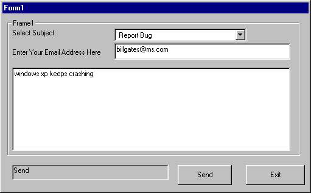



## Bug Report tool

### Description

Its avery basic program that you include with a program your writing to allow users to easily report bugs,errors,problems or send suggestion.

You can easily customize it, and with a a bit of work you could send the programs errors in the email.

This program is for reporting errors/commenst/etc by email via this program

Any comments or improvments you make please email me a copy.

I hope to use this with my new Mp3 program @ www.surf.to/mrdjmusicstudio
 
### More Info
 

             |
---                |---
**Submitted On**   |2001-08-25 04:32:32
**By**             |[irish\_bloke](https://github.com/Planet-Source-Code/PSCIndex/blob/master/ByAuthor/irish-bloke.md)
**Level**          |Beginner
**User Rating**    |5.0 (20 globes from 4 users)
**Compatibility**  |VB 5\.0, VB 6\.0
**Category**       |[Internet/ HTML](https://github.com/Planet-Source-Code/PSCIndex/blob/master/ByCategory/internet-html__1-34.md)
**World**          |[Visual Basic](https://github.com/Planet-Source-Code/PSCIndex/blob/master/ByWorld/visual-basic.md)
**Archive File**   |[Bug\_Report156804422003\.zip](https://github.com/Planet-Source-Code/irish-bloke-bug-report-tool__1-44441/archive/master.zip)

